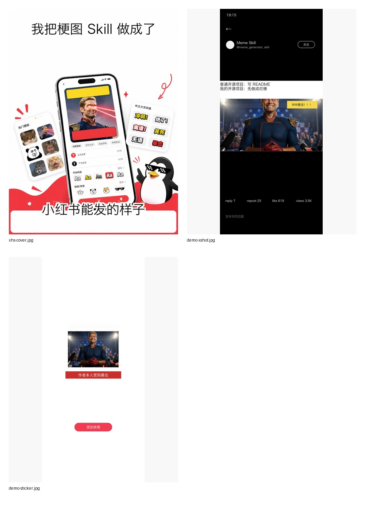
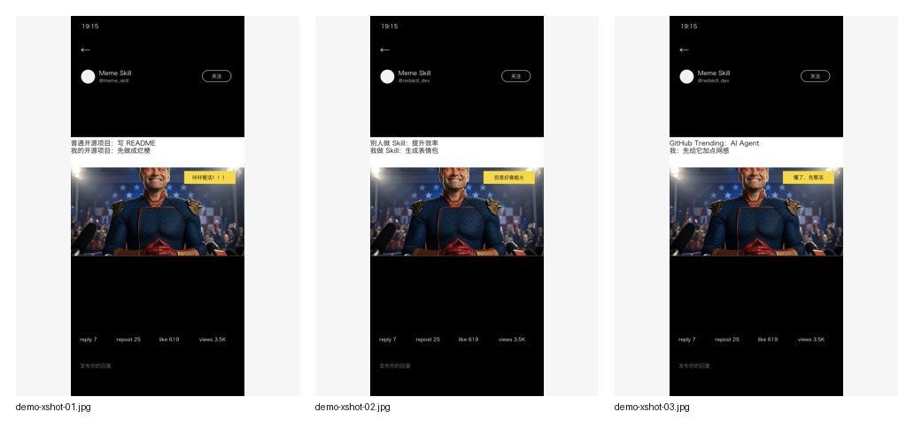
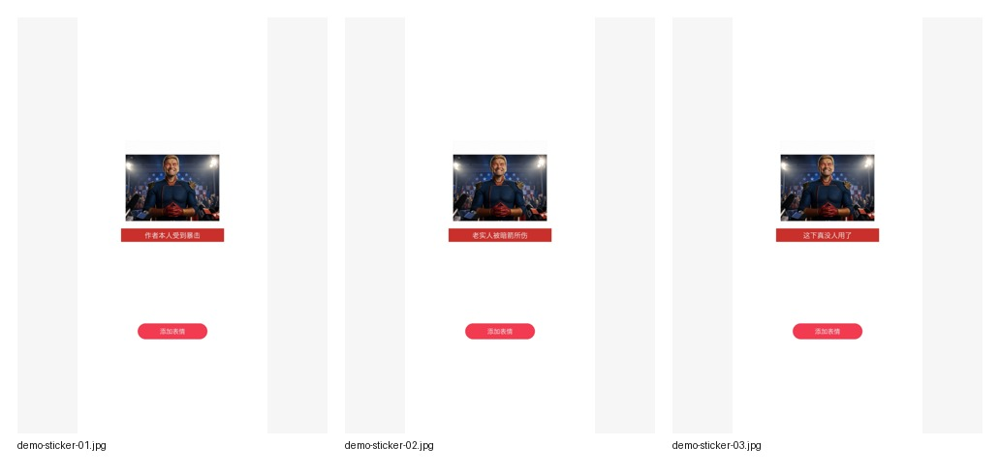
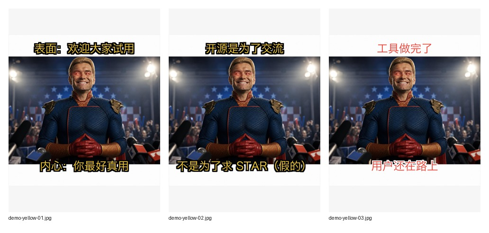
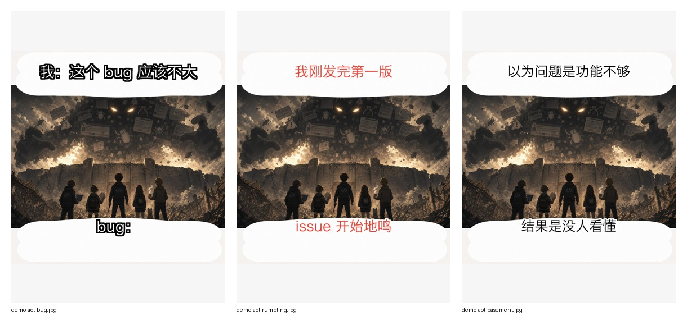

# meme-generator.skill


A Codex skill for making memes with more than plain top/bottom text.

It is built for one thing: make meme outputs that feel native to the platform, not like a generic captioning script.

## Demo



## More Demos

### Xiaohongshu Cover Style


### X/Twitter Screenshot Tech Meme



### Sticker Store Roast



### Chinese Yellow Text Meme



### Attack-on-Titan-Like Pressure Meme



### What it does

- Add classic meme captions to images
- Generate Chinese meme caption ideas
- Use Chinese-style layout presets like yellow text with black stroke
- Collect lightweight trend signals from GitHub Trending
- Compose platform-native layouts such as fake X screenshots and sticker-store-style images

## Why this exists

Most meme tools stop at adding text. This one adds a small meme workflow:

1. Find a scene or trend.
2. Generate caption angles.
3. Choose a platform-native visual style.
4. Render with preset typography and layout.

## Quick Start

Install the skill into Codex:

```bash
python3 ~/.codex/skills/.system/skill-installer/scripts/install-skill-from-github.py \
  --repo hyj-STAR/meme-generator.skill \
  --path . \
  --name meme-generator
```

Then restart Codex.

Install Python dependencies if you want to run scripts directly:

```bash
python3 -m pip install -r requirements.txt
```

## Core Components

### 1. Caption overlay

```bash
python3 scripts/meme_text.py input.jpg \
  --preset xiaohongshu-yellow \
  -t "表面：欢迎大家试用" \
  -b "内心：你最好真用" \
  -o output.jpg
```

Supported presets:

- `classic-white`
- `xiaohongshu-yellow`
- `rage-red`
- `subtitle-black`

### 2. Caption brain

Generate stronger Chinese meme angles before rendering:

```bash
python3 scripts/meme_brain.py "开源 AI 工具没人用 GitHub star" -n 8
```

### 3. Trend signals

Use public sources to seed meme ideas:

```bash
python3 scripts/trend_scraper.py --source github --limit 5 --angles
```

### 4. Platform-native layouts

Fake X screenshot style:

```bash
python3 scripts/meme_layout.py input.jpg \
  --style x-screenshot \
  --title "普通开源项目：写 README\n我的开源项目：先做成烂梗" \
  --punchline "咔咔整活！！！" \
  -o x-meme.jpg
```

Sticker-store roast style:

```bash
python3 scripts/meme_layout.py input.jpg \
  --style sticker \
  --caption "作者本人受到暴击" \
  -o sticker-meme.jpg
```

## Standard Prompt Pack

Use these as starting points:

- `表面：欢迎大家试用 / 内心：你最好真用`
- `开源是为了交流 / 不是为了求 STAR（假的）`
- `普通开源项目：写 README / 我的开源项目：先做成烂梗`
- `工具做完了 / 用户还在路上`
- `本来只是想提效 / 结果开始内容创业`

## Gallery Notes

- `assets/xhs-cover.jpg` is the Xiaohongshu-style cover
- `assets/demo-xshot.jpg` is the X screenshot style demo
- `assets/demo-sticker.jpg` is the sticker-store style demo
- `assets/demo-grid.jpg` shows the three together

## Reference Files

- `references/templates.md`: classic meme templates and common IDs
- `references/chinese-meme-playbook.md`: Chinese meme caption and layout rules
- `references/reference-styles.md`: visual recipes extracted from real meme screenshots
- `references/meme-reference-library.md`: meme-universe mechanics such as 进击的巨人-style despair, reversal, wall break, basement reveal, and rumbling

## X/Twitter Notes

Direct X scraping is brittle and often requires account auth, cookies, proxies, or paid infrastructure. This repo does not brute-force anti-bot systems.

The trend collector currently supports GitHub Trending by default. Reddit public JSON may be blocked depending on network conditions. X support is intentionally left as an optional adapter path for tools such as Scweet, twscrape, Twikit, official API access, or user-provided `X_AUTH_TOKEN`.

## Status

Experimental and evolving. Current focus: Chinese tech meme energy, GitHub, AI agents, Codex skills, open-source promotion, and developer self-roast.
